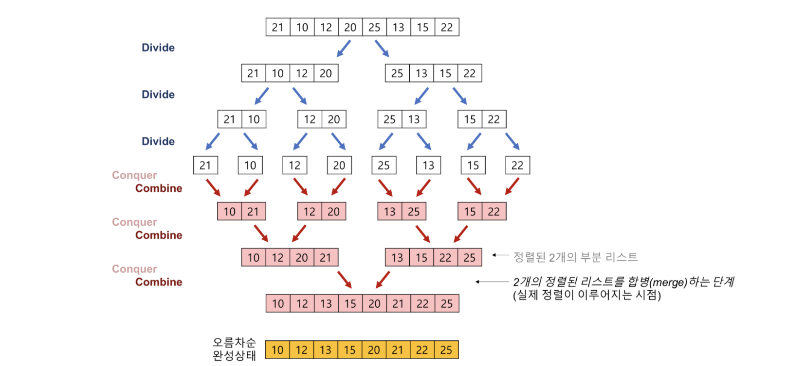
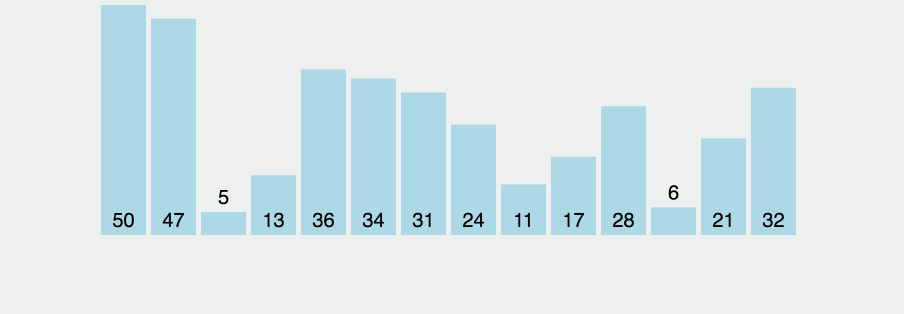

# 알고리즘 관련 질문

## 목차
- [Q. 정렬 알고리즘](#q-정렬-알고리즘)
- [Reference](#reference)


## Q. 정렬 알고리즘
정렬 알고리즘은 데이터를 특정한 순서대로 나열하는 것을 말합니다. 데이터를 정렬하는 데는 시간적인 요소가 중요합니다. 따라서 대표적으로 시간복잡도 O(N^2), O(NlogN)인 정렬 알고리즘과 그 외의 알고리즘으로 구분하여 설명하겠습니다. 아래의 정렬 알고리즘은 모두 오름차순 기준으로 설명합니다.

### 시간 복잡도 O(N^2) 정렬 알고리즘
O(N^2)의 시간이 소요되는 정렬 알고리즘은 대표적으로 버블 정렬, 선택 정렬, 삽입 정렬이 있습니다. O(N^2)은 데이터가 많아지면 매우 느려지는 단점이 있습니다.

#### 1. 버블 정렬(Bubble Sort)
버블 정렬은 인접한 두 개의 원소를 서로 비교한 후, 조건이 맞지 않으면 교환하는 방식입니다. 구현이 간단하고 코드가 직관적인 장점이 있습니다.


```java
private static void bubbleSort(int[] array, int size) {
    for (int i = 0; i < size - 1; ++i) {
        for (int j = 0; j < (size - i - 1); ++j) {
            if (array[j] > array[j + 1]) {
                int temp = array[j];
                array[j] = array[j + 1];
                array[j + 1] = temp;
            }
        }
    }
}
```

#### 2. 선택 정렬(Selection Sort)
선택 정렬은 자리를 지정해놓고, 그 자리에 들어갈 원소를 선택하는 방식입니다. 선택 정렬 역시 버블 정렬과 같이 단순하다는 장점이 있습니다.


```java
private static void selectionSort(int[] array, int size) {
    for (int i = 0; i < size - 1; ++i) {
        int minIdx = i;

        for (int j = i + 1; j < size; ++j) {
            if (array[minIdx] > array[j]) {
                minIdx = j;
            }
        }

        int temp = array[i];
        array[i] = array[minIdx];
        array[minIdx] = temp;
    }
}
```

#### 3. 삽입 정렬(Insertion Sort)
삽입 정렬은 2번째 원소부터 삽입될 데이터를 따로 저장해두고, 그 앞의 원소들과 비교하면서 자신이 삽입될 자리를 찾습니다. 앞의 원소들과 비교하면서 조건이 맞지 않는 경우 바로 뒤의 원소와 교환하면서 자리를 만들어냅니다.

삽입 정렬은 원소의 대부분 정렬이 되어 있는 경우에는 코드상 두 번째 for문이 거의 동작하지 않으므로 O(N)의 속도에 근접합니다. 그래서 정렬 라이브러리에서 부가적으로 자주 사용됩니다.


```java
private static void insertionSort(int[] array, int size) {
    for (int i = 1; i < size; ++i) {
        int insertionData = array[i];

        int insertionIndex;
        for (insertionIndex = i - 1; insertionIndex >= 0; --insertionIndex) {
            if (array[insertionIndex] > insertionData) {
                array[insertionIndex + 1] = array[insertionIndex];
            } else {
                break;
            }
        }

        array[insertionIndex + 1] = insertionData;
    }
}
```

### 시간 복잡도 O(NlogN) 정렬 알고리즘
시간 복잡도가 O(NlogN)인 정렬 알고리즘은 대표적으로 병합 정렬, 퀵 정렬, 힙 정렬 등이 있습니다.

#### 1. 병합 정렬(Merge Sort)
병합 정렬은 **분할 정복(Divide and conquer)** 알고리즘을 사용합니다. 분할 정복은 말 그대로 문제를 분할한 후 정복(해결)한다는 방법입니다. 복잡한 문제를 분할하여 단순화한 후 해결하는 것이 목적입니다.

병합 정렬은 데이터의 개수가 1개가 될 때까지 분할한 후, 정복하는 과정에서 데이터를 합치면서 비교하여 정렬합니다.


병합 정렬은 위 그림보다는 아래 그림이 더 직관적일 것입니다.


출처: <https://gmlwjd9405.github.io/2018/05/08/algorithm-merge-sort.html>

병합 정렬은 정복 과정에서 각 레벨에서 비교후 합치는 연산이 O(N)이 소요되고, 레벨의 깊이가 O(logN)이므로 결과적으로 O(NlogN)의 시간이 소요됩니다. 하지만 병합하는 과정에서 임시 배열을 사용하므로 공간 복잡도가 O(N)입니다.

```java
private static void mergeSort(int[] arr, int left, int right, int[] helper) {
    if (left < right) {
        int mid = (left + right) / 2;
        mergeSort(arr, left, mid, helper);
        mergeSort(arr, mid + 1, right, helper);
        mergeTwoArea(arr, left, mid, right, helper);
    }
}

private static void mergeTwoArea(int[] arr, int left, int mid, int right, int[] helper) {
    int leftAreaIdx = left;
    int rightAreaIdx = mid + 1;

    int sortArrIdx = left;

    while (leftAreaIdx <= mid && rightAreaIdx <= right) {
        if (arr[leftAreaIdx] < arr[rightAreaIdx]) {
            helper[sortArrIdx] = arr[leftAreaIdx++];
        } else {
            helper[sortArrIdx] = arr[rightAreaIdx++];
        }
        sortArrIdx++;
    }

    if (leftAreaIdx <= mid) {
        for (int i = leftAreaIdx; i <= mid; ++i) {
            helper[sortArrIdx++] = arr[i];
        }
    } else if (rightAreaIdx <= right) {
        for (int i = rightAreaIdx; i <= right; ++i) {
            helper[sortArrIdx++] = arr[i];
        }
    }

    for (int i = left; i <= right; ++i) {
        arr[i] = helper[i];
    }
}
```

#### 2. 퀵 정렬(Quick Sort)
퀵 정렬은 이름대로 정렬 알고리즘 중에서 평균적으로 가장 빠른 알고리즘입니다. 그리고 병합 정렬과 비교해서 임시 배열도 사용하지 않습니다. 하지만 최악의 시간 복잡도는 O(N^2)이라는 단점을 가지고 있습니다.

퀵 정렬은 병합 정렬과 같이 분할 정복 방식으로 동작합니다. 하지만 병합 정렬처럼 반으로 균등하게 나누는 것이 아닌 pivot을 기준으로 비균등하게 나뉩니다. pivot의 위치는 pivot의 왼쪽은 모두 pivot보다 작은 값이고, 오른쪽은 모두 pivot보다 큰 값입니다. 즉 pivot은 정렬된 위치를 가리키며, 이를 찾는 과정을 `partition`이라고 합니다. 퀵 정렬은 이처럼 `partition`을 통해 pivot을 찾고, 이 pivot을 기준으로 왼쪽과 오른쪽으로 분할합니다. 여기서 pivot은 이미 정렬된 위치에 있으므로 제외합니다. 이 분할된 공간에서 다시 `partition`을 통해 pivot을 찾는 과정을 재귀적으로 반복합니다.



위 그림은 `partition` 과정을 보여줍니다.
- 노란색: 정렬되기전 pivot 위치(partition의 시작 단계에서 pivot 위치)
- 주황색: 정렬이 완료된 pivot 위치(partition이 끝난 후 pivot 위치)
- 초록색: pivot보다 작은 값(low)
- 보라색: pivot보다 큰 값(high)
- 빨간색: 현재 위치

위 그림을 아래의 코드와 같이 보면 이해하기 쉬울 것입니다.

```java
private static void quickSort(int[] arr, int left, int right) {
    if (left <= right) {
        int pivot = partition(arr, left, right);
        quickSort(arr, left, pivot - 1);
        quickSort(arr, pivot + 1, right);
    }
}

private static int partition(int[] arr, int left, int right) {
    int pivot = arr[left];
    int low = left + 1;
    int high = right;

    while (low <= high) {
        while (low <= right && pivot >= arr[low])
            low++;
        while (high >= (left + 1) && pivot <= arr[high])
            high--;

        if (low <= high) {
            swap(arr, low, high);
        }
    }

    swap(arr, left, high);

    return high;
}

private static void swap(int[] arr, int i1, int i2) {
    int temp = arr[i1];
    arr[i1] = arr[i2];
    arr[i2] = temp;
}
```

퀵 정렬의 worst case는 pivot이 partition 결과로 배열의 가장 왼쪽이나 가장 오른쪽에 계속해서 위치하는 경우입니다. 이는 pivot 기준으로 분할할 때 n개에서 (n-1), (n-2), (n-3), ... 으로 나뉘기 때문에 시간 복잡도는 O(N^2)과 같습니다.

따라서 pivot의 위치는 최대한 중간에 위치하여 분할할 때 반반씩 나뉘는 것이 best case가 됩니다. 이를 위해 partition을 시작할 때 pivot을 어느 값으로 정할 지가 중요해집니다. 특정 위치보다는 랜덤하게 pivot을 정하는 것이 더 효율적이라고 알려져있습니다.

#### 3. 힙 정렬(Heap Sort)
힙 정렬은 힙 자료구조를 사용한 정렬입니다. 힙은 우선순위 큐라고도 하는데, 최대 힙(Max Heap)은 항상 저장된 데이터 중 최대값이 먼저 나오고 최소 힙(Min Heap)은 최소값이 먼저 나오는 자료구조입니다.

이를 이용해서 최대 힙은 오름차순으로, 최소 힙은 내림차순으로 사용할 수 있습니다. 그리고 힙을 삽입, 삭제하는데 O(logN)의 시간복잡도가 소요되므로, N개의 데이터를 힙으로 만든 뒤, 모두 꺼내는데 총 O(NlogN)의 시간이 소요됩니다.

### 정렬 알고리즘 비교

| Algorithm | In-Place | Stable | Comparison | Time Complexity |
|:---------:|:--------:|:------:|:----------:|:----------:|
|   Bubble  |     O    |    O   |      O     |   O(n^2)   |
| Selection |     O    |    O   |      O     |   O(n^2)   |
| Insertion |     O    |    O   |      O     |   O(n^2)   |
|   Shell   |     O    |    O   |      O     |   O(n^2)   |
|   Merge   |     X    |    O   |      O     |  O(nlogn)  |
|    Heap   |     O    |    X   |      O     |  O(nlogn)  |
|   Quick   |     O    |    X   |      O     |  O(nlogn)  |
|  Counting |     X    |    O   |      X     |   O(n+k)   |
|   Radix   |     X    |    O   |      X     |  d * O(n)  |
|   Bucket  |     X    |    O   |      -     |    O(n)    |

- In-Place: 이를 만족한다는 것은 별도의 저장 공간을 사용하지 않고 내부에서 정렬이 이루어지는 것을 말합니다.
- Stable: 정렬되지 않는 상태에서 같은 값의 원소의 순서가 정렬된 후에도 순서가 변경되지 않는 것을 Stable하다고 합니다.
- Comparison: 값을 비교하여 정렬하는지 여부를 말합니다.

## Reference
- [정렬 시뮬레이션](https://www.toptal.com/developers/sorting-algorithms)