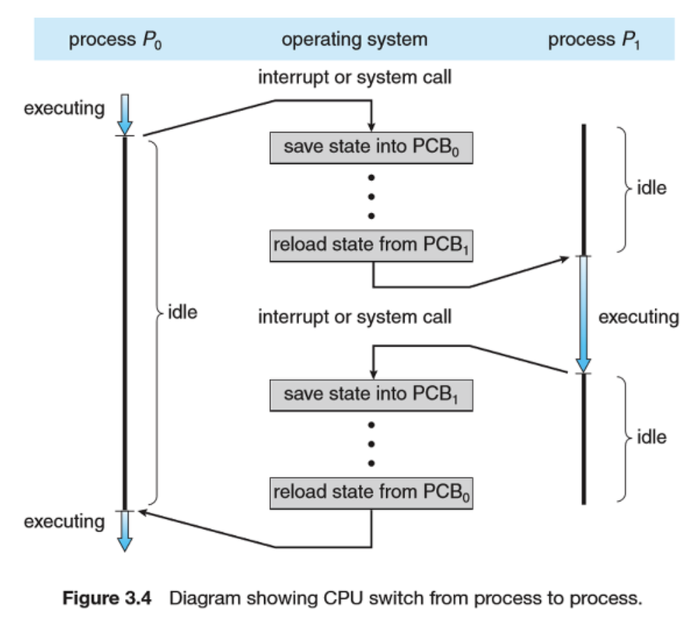

# 운영체제 관련 질문

## Q. 프로세스(Process)와 쓰레드(Thread)에 대해 설명하시오.
### 1. 프로세스
프로세스는 디스크에 있는 프로그램을 메인 메모리에 적재하여 실행되고 있는 상태를 말합니다. 프로그램이 실행한다는 것은 운영체제에게 Code, Data, Stack, Heap 영역의 메모리를 할당받고, CPU와 I/O 등 연산을 수행할 수 있는 상태를 말합니다. 프로세스는 각각의 메모리를 독립적으로 할당받기 때문에 서로 다른 프로세스와 통신하려면 비용이 큽니다. 그리고 쓰레드를 1개 이상을 갖고 있습니다.

#### PCB(Process Control Block)
PCB는 프로세스의 모든 정보를 담고 있는 운영체제의 자료구조입니다. 운영체제는 프로세스를 관리하기 위해 프로세스의 생성과 동시에 고유한 PCB 를 생성합니다. CPU는 하나의 프로세스만 실행하는 것이 아닌 여러 프로세스를 번갈아가면서 실행합니다. 이를 할 수 있는 이유는 운영체제에서 각각의 프로세스 상태를 PCB로 가지고 있기 때문입니다. 

PCB에 저장되어 있는 정보는 다음과 같습니다.
- **프로세스 식별자(Process ID, PID)** : 프로세스 식별번호
- **프로세스 상태** : new, ready, running, waiting, terminated 등의 상태를 저장
- **프로그램 카운터(Program Counter, PC)** : 프로세스가 다음에 실행할 명령어의 주소
- **CPU 레지스터 및 일반 레지스터**
- **CPU 스케쥴링 정보** : 프로세스의 우선순위, 스케줄 큐에 대한 포인터 등
- **메모리 관리 정보** : 프로세스의 주소 공간, 페이지 테이블 또는 세그먼트 테이블 정보 등
- **입출력 상태 정보** : 프로세스에 할당된 입출력 장치들과 열린 파일 목록
- **어카운팅 정보** : 사용된 CPU 시간, 시간제한, 계정번호 등

### 2. 쓰레드
쓰레드는 프로세스의 실행 단위로 볼 수 있습니다. 프로세스 내부의 Stack을 제외한 메모리 공간을 공유하기 때문에 한 프로세스에 여러 쓰레드가 있다면 쓰레드 사이에 자원을 공유하는데 비용은 크지 않습니다. 하지만 여러 쓰레드가 한 자원을 공유할 때는 동기화를 해주어야 하므로 이에 대한 비용이 발생할 수 있습니다. 쓰레드는 독립된 실행을 위한 쓰레드 ID, PC, 레지스터, 스택으로 이루어져 있습니다.

#### Stack 영역을 쓰레드마다 독립적으로 할당하는 이유
프로그램을 실행한다는 것은 함수를 실행한다는 것과 같습니다. 함수 호출시 전달하는 인자, 함수가 끝나고 되돌아갈 위치, 함수 내에 선언하는 변수 등을 저장하는 영역이 Stack 메모리 영역입니다. 즉 함수를 실행하는데 필요한 정보를 담는 곳이 Stack 영역이므로, 독립적으로 함수를 실행하기 위해서는 최소한 Stack 영역이 필요합니다.

#### PC를 쓰레드마다 독립적으로 할당하는 이유
프로그램 카운터는 현재 쓰레드가 어디까지 진행되었는지 알 수 있는 정보입니다. CPU는 여러 쓰레드를 번갈아가면서 실행하는데, 실행중인 한 쓰레드가 중단되었다가 다시 이어서 실행하기 위해서는 그 전에 어디까지 수행했는지에 대한 정보인 PC가 필요합니다.

### 3. Context Switching(문맥 교환)
문맥 교환은 CPU에서 프로세스나 쓰레드를 번갈아 수행하는 것을 말합니다. 운영체제는 하드웨어 자원을 효율적으로 사용하기 위해 메인 메모리에 여러 프로세스나 쓰레드 단위를 적재한 후 CPU가 이를 번갈아 실행하도록 합니다. 이 때 CPU가 한 프로세스를 수행중인 것을 멈추고 다른 프로세스를 실행하는 것을 문맥 교환이라고 말합니다.

#### Context Switching Overhead
문맥 교환을 할 때마다 현재 프로세스(쓰레드) 상태를 저장하고, 다음 실행할 프로세스 상태를 가져오는 작업을 해야합니다. 이 때 발생하는 비용을 Context Switching Overhead라고 합니다.

위는 프로세스 P0에서 P1으로 문맥 교환이 발생하는 그림입니다. 여기서 P1의 idle 상태가 Context Switching Overhead입니다. 이 순간에는 CPU가 어떠한 일도 할 수 없기 때문에 매우 비효율적인 작업입니다.

문맥 교환은 프로세스 단위나 쓰레드 단위로 할 수 있는데, 프로세스가 쓰레드보다 가지고 있는 정보량이 많으므로 Context Switching Overhead도 큽니다.

### 4. Multi Process VS Multi Thread
멀티 프로세스는 여러 프로세스를 동시에 수행하는 환경이고, 멀티 스레드는 여러 스레드를 동시에 수행하는 환경입니다.

멀티 프로세스는 서로 독립적이기 때문에 데이터 통신하는 비용이 크고, 저장하고 있는 정보가 많아 context switching 오래 소요됩니다. 하지만 서로 독립적이므로 한 프로세스의 오류가 다른 프로세스에 영향을 주지 않아 안정적입니다.

멀티 스레드는 한 프로세스 내에서 Stack을 제외한 다른 메모리 영역을 공유하므로 자원에 대한 동기화 작업을 해야합니다. 그리고 한 스레드의 오류가 다른 스레드에 영향을 미칠 수 있습니다. 하지만 공유하고 있는 자원이 있으므로 스레드 사이에 통신이 간단하고, context switching에서 멀티 프로세스와 달리 가지고 있는 정보가 적고 캐시 메모리를 비우는 작업이 없어 더 빠릅니다.

멀티 스레드와 멀티 프로세스는 각각의 장단점이 있으므로, 정답은 없습니다. 시스템에 따라 적절한 동작 방식을 선택해서 사용해야합니다.

## Q. 교착상태(DeadLock, 데드락)에 대해 설명하시오.
