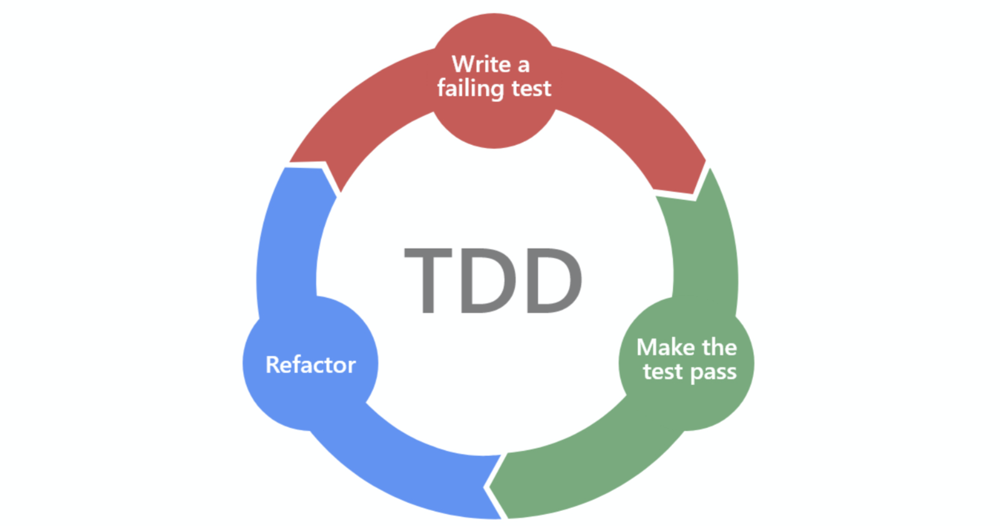
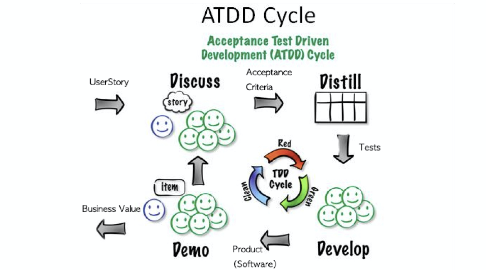

# 테스트 코드 관련 질문

## Q. 테스트 코드의 장단점
제가 경험했던 테스트 코드의 장점은 세 가지입니다.
1. 기능에 대한 확신을 할 수 있어 불안감을 해소해줍니다.
2. 리팩토링한 후 바로 테스트 코드로 확인할 수 있습니다.
3. 테스트 코드를 통해 프로덕션 코드를 이해할 수 있습니다.

테스트 코드의 단점은 비용입니다. 테스트 코드에 익숙하지 않을수록 테스트 코드에 대한 비용은 커지고 부담스러워집니다. 그리고 테스트 코드의 학습이 어려운 점도 있습니다. 좋은 테스트를 하기 위해서는 좋은 설계를 해야하고 여러 상황을 파악해야 하며 필요한 도구를 사용할 수 있어야 합니다.

## Q. 좋은 테스트 코드
좋은 테스트 코드를 위해서는 테스트 코드의 안티 패턴을 피하는 것도 방법입니다.

### 소프트웨어 테스트 안티 패턴
- 통합 테스트를 전혀 작성하지 않는다.
- 유닛 테스트를 전혀 작성하지 않는다.
- 잘못된 종류의 테스트를 작성한다.
- 테스트 우선 순위 선정에 실패한다.
    - 중요 코드: 자주 깨지고, 가장 많은 새로운 기능이 추가되며, 유저에게 가장 큰 영향을 끼친다.
    - 핵심 코드: 가끔 깨지고, 많은 새로운 기능이 추가되며, 유저에게 큰 영항을 끼친다.
    - 기타 코드: 거의 깨지지 않고, 새 기능이 거의 추가되지 않으며, 유저에게 큰 영향을 끼치지 않는다.
- 내부 구현을 테스트한다.
    - 새로운 기능을 하나 추가할 때마다 여러 개의 테스트 코드를 리팩토링해야 한다면 내부 구현을 테스트하고 있을 가능성이 높다.
- 코드 커버리지에 대해 과도하게 집착한다.
- 자주 실패하거나 너무 느린 테스트 코드를 작성한다.
- 테스트 코드에 대해 클린 코드 원칙을 준수하지 않고 리팩토링을 하지 않는다.
- 프로덕션 코드에서 발생한 버그에 대해 테스트하지 않는다.
- TDD를 맹목적으로 따른다.
- 공식문서를 읽지 않고 테스트 코드를 작성한다.
- 잘 알지 못한 채 테스트 코드를 비난한다.

## Q. TDD(Test-Driven Development)
TDD는 기본적으로 프로덕션 코드보다 테스트 코드를 먼저 작성하는 개발 방법입니다. TDD는 세 가지 동작의 싸이클로 행해집니다.

위 그림은 TDD 싸이클을 나타냅니다.
1. 실패하는 테스트 코드를 작성한다.
2. 실패하는 테스트를 통과시킬 단순한 프로덕션 코드를 빠르게 작성하여 통과시킨다.
3. 작성된 프로덕션 코드와 테스트 코드를 리팩토링한다.

TDD는 위 세 가지 동작을 빠르게 반복하여 개발하는 방식입니다.

### TDD의 장단점
TDD의 장점은 다음과 같습니다.
- 테스트를 먼저 작성하다보면 기능을 작은 단위로 분리하게 되고 이 기능을 테스트를 통해 확신을 가지면서 구현을 진행할 수 있습니다.
    - 작은 단위의 기능으로 분리하면서 생기는 이점은 객체지향의 이점과 비슷합니다. 책임을 분리하여 변경의 전파를 최소화할 수 있습니다.
- 테스트의 습관화와 높은 테스트 커버리지를 유지할 수 있습니다.

TDD의 단점은 높은 학습 비용입니다. 테스트 코드에 대한 충분한 이해가 있어야 하며, 프로덕션 코드보다 테스트 코드를 먼저 작성하려면 경험이 많이 필요하다고 생각합니다. 그리고 TDD는 충분한 설계를 바탕으로 시작해야 합니다.

### ATDD(Acceptance Test Driven Development)
ATDD는 용어를 그대로 풀이하면 인수 테스트 주도 개발입니다. 프로덕션 코드보다 인수 테스트 코드를 먼저 작성하는 개발 방법입니다. 이는 TDD의 단위 테스트의 문제점을 극복하기 위함이기도 합니다. 단위 테스트는 여러 객체, 데이터베이스와 같은 외부와 상호작용하는 전체 기능을 테스트하지 못합니다. 각각의 단위 테스트는 동작할 수 있지만 전체 기능에는 문제가 발생할 수 있습니다. 기본적으로 이를 해결하려는 것이 ATDD입니다.

> 인수 테스트에서 인수는 클라이언트가 요청한 소프트웨어의 결과물을 넘겨 받는다는 의미이며, 이를 테스트한다는 것은 요구사항을 모두 만족하여 기능 완료 여부를 테스트한다고 할 수 있습니다.

ATDD는 인수 테스트가 가지는 이점을 넘어 사용자(고객), 개발자, 테스터간의 활발한 커뮤니케이션을 기반한 개발 방법입니다. 따라서 애자일과 매우 잘 어울리는 개발 방법이기도 합니다.

#### ATDD Cycle

출처: <https://boorownie.github.io/2019-11-27/agail_and_atdd>

- UserStory: 사용자가 원하는 요구사항
- Discuss: UserStory를 바탕으로 인수 조건을 도출
- Distill: 인수 조건을 바탕으로 인수 테스트 작성
- Develop: 문서화와 TDD를 바탕으로 개발
- Demo: 인수 테스트가 성공하면 요구사항이 정상적이라는 것을 확인할 수 있고, 개발 진행 상황을 파악할 수 있음

## Q. Spring Boot를 활용한 API 서버 테스트 코드
레이어드 아키텍처 기반의 패키지 구조별로 테스트를 작성할 수 있습니다.
- Controller Layer: Mock을 활용한 단위 테스트, 인수 테스트
- Service Layer: Mock을 활용한 단위 테스트, 통합 테스트
- Domain: 단위 테스트
    - Spring Data JPA를 사용한다면 Repository도 도메인 레이어에 포함

## Q. BDD

